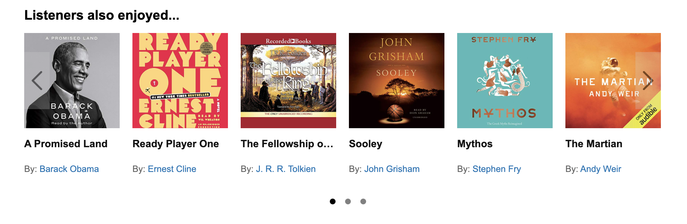
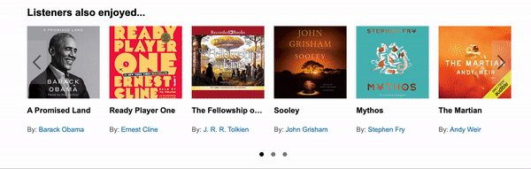
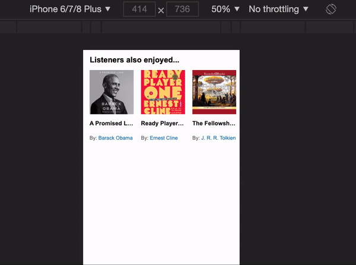

# Also Enjoyed Service
## Table of Contents
- [1.1 Related Projects](#11-related-projects)
- [1.2 Usage ](#12-usage)
- [1.3 Requirements / Setup](#13-requirements-setup)
- [1.4 Backlog / Noted Opportunities](#14-backlog-noted-opportunities)

## 1.1 Related Projects
- [Title Service](https://github.com/huang-pei-mei/title-service)
- [Price Service](https://github.com/huang-pei-mei/price-service)
- [Summary Service](https://github.com/huang-pei-mei/FEC-Publishers-Summary)
- [Aggregate Review Service](https://github.com/huang-pei-mei/FEC-Agg.Review)
- [Review Service](https://github.com/huang-pei-mei/reviews-service)

## 1.2 Usage
The Also Enjoyed Service is a fullstack service that provides a list of related items for an Audible item page, and displays them in a carousel with a modal element for additional information.



- Scroll Feature





- Modal Feature

### 1.2.1 API Endpoints
- GET `/api/relatedIds/:bookId`
  - Given a `bookId`, retrieve a list of 18 bookIds that listeners of the present book also enjoyed.

## 1.3 Requirements / Set Up {#13-requirements-setup}
**Requirements:**
- Node v14.15.0

### 1.3.1 Install MongoDB and Create AlsoEnjoyed Database
1. Follow instructions for your platform's community edition in [this link](https://docs.mongodb.com/manual/installation/)
2. Start MongoDB: `brew services start mongodb-community@VERSION`
3. Create the alsoEnjoyed Database: `npm run seed-db`

### 1.3.2 Setup Environment Variables
1. Within root directory, create a `.env` file: `touch .env`
2. Open the file and add the `ENV` field (values `[dev, prod]`)

### 1.3.3 Install Dependencies
1. Within root directory, run
```npm install```

### 1.3.4 Start Service
1. Within root directory, create bundle file:
```npm run react-prod```
2. Within root directory, launch server:
```npm start```

## 1.4 Backlog / Noted Opportunies {#14-backlog-noted-opportunities}
- Enable RESTful client with path parameters instead of query parameters
- Improve client accessibility